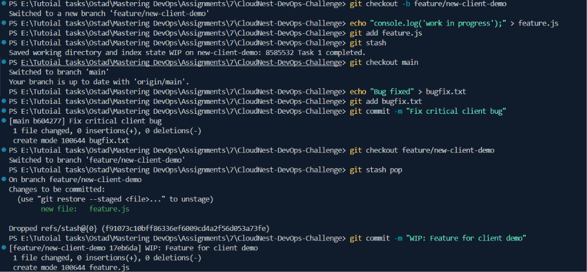
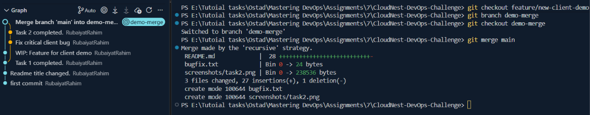
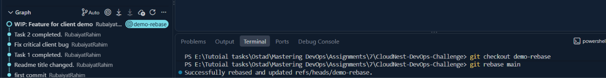
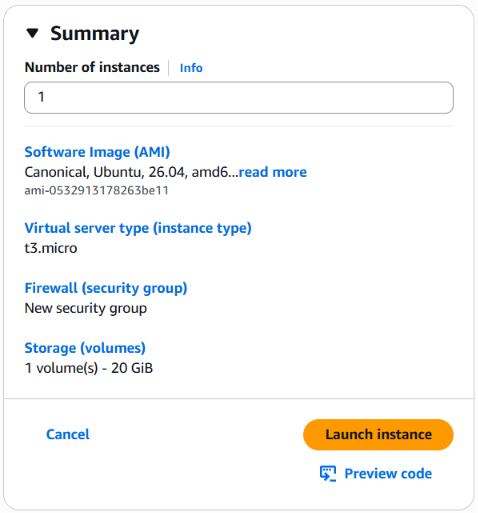
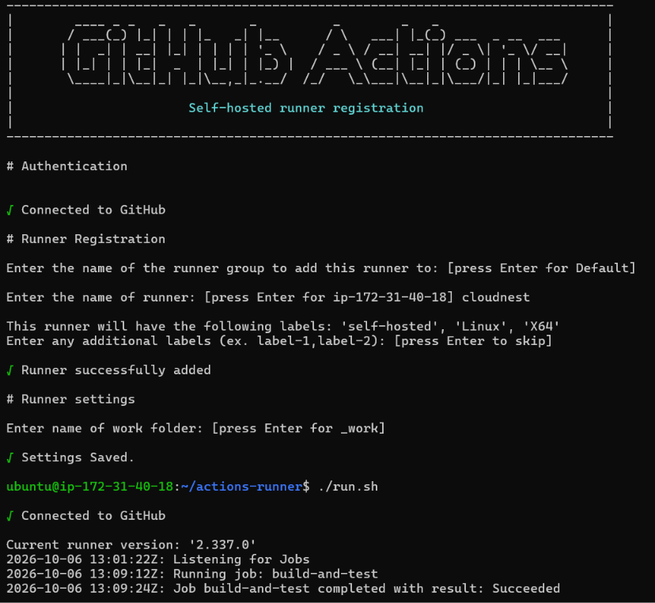
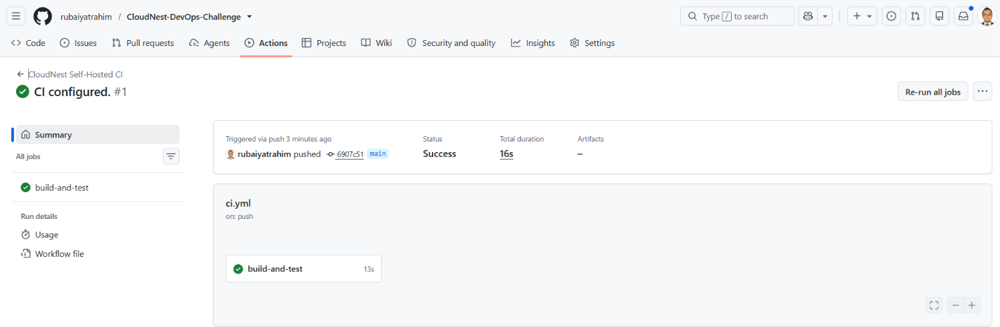
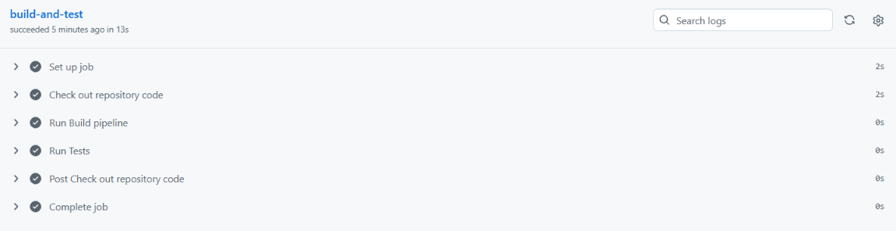
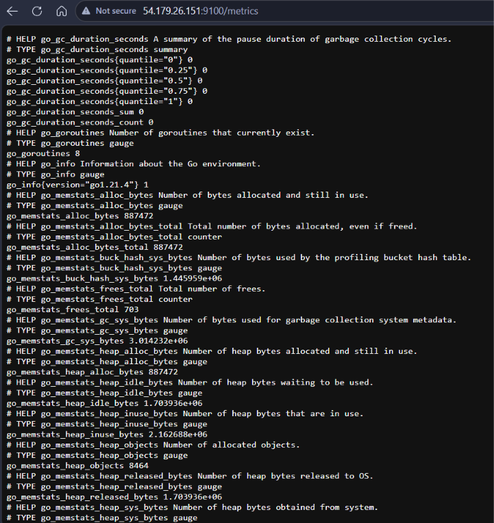

# CloudNest DevOps Challenge

**Student Name:** Md. Rubaiyat Rahim <br/>
**Batch:** DevOps Batch 14 <br/>
**Assignment Title:** The Friday Night Fix

## Task 1: Starting Fresh

To keep new work separate from the main branch, we need to create and switch to a new feature branch.

```
git checkout -b feature/new-client-demo
```

_Why:_ This creates a safe, isolated branch (`feature/new-client-demo`) based on the most up-to-date version of `main`. If things break, `main` remains untouched. <br/>

## Task 2: Interrupted Work

We are halfway through writing code when the urgent bug comes in. We must temporarily shelf our work without committing incomplete code.

```
# Make some incomplete changes
echo "console.log('work in progress');" > feature.js
git add feature.js
# Stash the work
git stash

# Fix the urgent bug
git checkout main
echo "Bug fixed" > bugfix.txt
git add bugfix.txt
git commit -m "Fix critical client bug"

# Restore the incomplete work
git checkout feature/new-client-demo
git stash pop
git commit -m "WIP: Feature for client demo"
```

_Why:_ `git stash` safely stores our modified tracked files and staged changes on a stack of unfinished changes, giving us a clean working directory to address the urgent bug. <br/>


## Task 3: Cleaning the History

Nadia wants to see two different ways of bringing a feature branch up to date: a rebase (linear history) and a merge (preserved history). So, we duplicate our current feature branch so we can demonstrate both methods side-by-side.

```
git checkout feature/new-client-demo
git branch demo-rebase
git branch demo-merge

# The Merge Approach (Preserves history)
git checkout demo-merge
git merge main
# (If a text editor opens, save and close it to accept the merge commit)

# The Rebase Approach (Linear history)
git checkout demo-rebase
git rebase main
```

_The Merge Approach Result:_ This creates a "merge commit." It preserves the exact chronological history and shows that the feature branch lived independently before being joined back.<br/>

_The Rebase Approach Result:_ This rewinds our feature branch commits, pulls in the new main commits, and replays our feature commits on top. It looks like we wrote our feature after the latest main updates, keeping a clean, straight line of history.<br/>


## Task 4: The Embarrassing Message

Fix a bad commit message.

```
git checkout feature/new-client-demo

# Create a file named asdf.txt
git add asdf.txt
git commit -m "asdf fix"

# Fix the message
git commit --amend -m "Fix database connection timeout issue"
```

## Task 5: Our Own CI

### 5.1 Create EC2 Instance

At first a new EC2 instance was created as follows:<br/>

<br/>

### 5.2 Configure Self-Hosted Runner

To replace the paid cloud service with a self-hosted runner, we will use GitHub Actions configured for a self-hosted machine.

#### 5.2.1. Go to our GitHub Repository > Settings > Actions > Runners.

#### 5.2.2. Click New self-hosted runner. Select Linux, x64.

#### 5.2.3. SSH into our Ubuntu server and run the exact download/configure commands GitHub provides.

_Download_

```
# Create a folder
$ mkdir actions-runner && cd actions-runner# Download the latest runner package
$ curl -o actions-runner-linux-x64-2.337.0.tar.gz -L https://github.com/actions/runner/releases/download/v2.337.0/actions-runner-linux-x64-2.337.0.tar.gz# Optional: Validate the hash
$ echo "70920811a4f8ad4328818682bca5c6469c1c942fab52448868071d0063816613  actions-runner-linux-x64-2.337.0.tar.gz" | shasum -a 256 -c# Extract the installer
$ tar xzf ./actions-runner-linux-x64-2.337.0.tar.gz
```

_Configure_

```
# Create the runner and start the configuration experience
$ ./config.sh --url https://github.com/rubaiyatrahim/CloudNest-DevOps-Challenge --token ADERNOCSXS3YJ6565EI3WCDKYT6XU# Last step, run it!
$ ./run.sh
```

_Using your self-hosted runner_

```
# Use this YAML in your workflow file for each job
runs-on: self-hosted
```

### 5.3 Configure the Pipeline

Create a file in your project at `.github/workflows/ci.yml`:

```
name: CloudNest Self-Hosted CI
on: [push]
jobs:
  build-and-test:
    runs-on: self-hosted
    steps:
      - name: Check out repository code
        uses: actions/checkout@v3
      - name: Run Build pipeline
        run: echo "Building project..."
      - name: Run Tests
        run: echo "Testing project..."
```

### 5.4 Test Push

Commit the changes to main and push to see the CI pipeline running.<br/>
<br/>
CI found succeeded to run the pipeline in GitHub.<br/>
<br/>

_Why:_ By specifying `runs-on: self-hosted`, the CI pipeline bypasses GitHub's paid cloud runners and executes directly on the company-owned server where the runner agent is listening.

## Task 6: The Blind Server

We will install and run Node Exporter, Prometheus, Alloy and Grafana to complete this task.

### 6.1. Node Exporter Setup

Node Exporter collects system-level metrics (CPU, RAM, Disk, Network) and exposes them on port 9100.

#### 6.1.1. Download and Extract Binary:

```
wget https://github.com/prometheus/node_exporter/releases/download/v1.7.0/node_exporter-1.7.0.linux-amd64.tar.gz
tar xvfz node_exporter-1.7.0.linux-amd64.tar.gz
sudo mv node_exporter-1.7.0.linux-amd64/node_exporter /usr/local/bin/
rm -rf node_exporter-1.7.0.linux-amd64\*
```

#### 6.1.2. Create System User:

```
sudo useradd --no-create-home --shell /bin/false node_exporter
```

#### 6.1.3. Configure Systemd Service:

Create a service file: `sudo nano /etc/systemd/system/node_exporter.service`

```
[Unit]
Description=Node Exporter
After=network.target

[Service]
User=node_exporter
Group=node_exporter
Type=simple
ExecStart=/usr/local/bin/node_exporter

[Install]
WantedBy=multi-user.target
```

#### 6.1.4. Start and Verify:

```
sudo systemctl daemon-reload
sudo systemctl enable --now node_exporter
sudo systemctl start node_exporter
sudo systemctl status node_exporter
```

#### 6.1.5. Add Inbound Rule to Allow Port `9100` from Anywhere

#### 6.1.6. **Screenshot Requirement:** Open `http://<SERVER_IP>:9100/metrics` in the browser.


